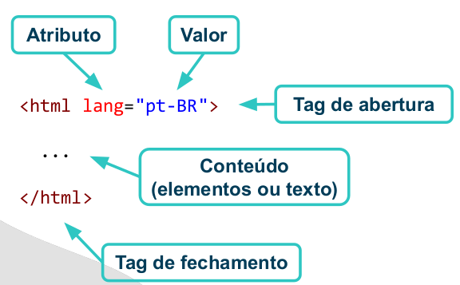
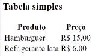
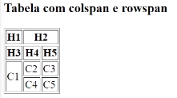
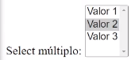

# Fullstack

Emmet commands Cheat Sheet 

- [Emmet Commands](https://docs.emmet.io/cheat-sheet/)

## HTML - HyperText Markup Language.

Hipertexto: texto não linear, com diversos conteúdos

    - Interconectados (links).

Define conteúdo e estrutura.

- Fontes de consulta:
  - MDN Web Docs (https://developer.mozilla.org/).
  - Especificação do W3C (https://www.w3.org/html/)


### Estrutura de um documento
```html
<!DOCTYPE html>
<html lang="pt-BR">
<head>
    <title>Meu documento</title>
</head>
<body>
    <p>Este é um documento HTML.</p>
</body>
</html>
```

### Sintaxe de um elemento


### Metadados
```html
<!DOCTYPE html>
<head lang="pt-BR">
    <meta charset="utf-8" />
    <title>Exemplo de HTML</title>
    <meta name="description" content="Descrição da página" />
    <meta name="viewport" content="width=device-width, initial-scale=1" />
</head>
```
### Elementos basicos
```html
<!-- Isto e um comentario HTML -->

<!-- Um paragrafo -->
<p></p>

<h1>Este é um título</h1>
  <p>Existem diferentes níveis de título, do 1 ao 6:</p>
<h2>Título nível 2</h2>
<h3>Título nível 3</h3>
<h4>Título nível 4</h4>
<h5>Título nível 5</h5>
<h6>Título nível 6</h6>

<p>
    É possível <em>enfatizar</em> uma palavra com o elemento em, dar
    <strong>ainda mais ênfase</strong> com o elemento strong, ou marcar uma
    palavra com o elemento <mark>mark</mark>. Embora existam os elementos i
    (<i>itálico</i>) e b (<b>negrito</b>), eles não são mais recomendados, pois
    o HTML deve focar no conteúdo e semântica, deixando a estilização para o
    CSS.
  </p>

  <p>
    Também podemos demarcar código fonte com o elemento
    <code>code</code>, ou demarcar entrada de teclado com o elemento
    <kbd>kbd</kbd>.
  </p>

  <p>
    Podemos forçar uma quebra de linha aqui <br />
    com o elemento br.
  </p>

  <p>
    Podemos usar sub para subscrito, como em H<sub>2</sub>O, ou sup para
    sobrescrito, como em x<sup>2</sup>.
  </p> 

```
### Imagens

```html
<p>
    Imagens são inseridas com o elemento img.
    
    
  </p>

```
```html
<p>A imagem pode ser hospedada em outro site.
  
</p>
```

### Links
```html
<p>
    O elemento a corresponde a um
    <a href="./pagina2.html">link para outro documento</a>.
</p>
```
```html
<p>
  Links podem ser relativos ou absolutos, dependendo do formato do atributo href. Este é um
    <a href="http://localhost:8080/c02-html/a02-texto-imagens-links/subpasta/pagina3.html" >link absoluto</a
    >.
</p>
```
```html
<p>
  Links podem ser relativos ou absolutos, dependendo do formato do atributo href. Este é um
    <a href="http://localhost:8080/c02-html/a02-texto-imagens-links/subpasta/pagina3.html" >link absoluto</a
    >.
</p>
```
```html
<p>
    Também podemos abrir link em nova aba com o atributo
    <code>target="_blank"</code>:
    <a href="pagina2.html" target="_blank">Página 2</a>.
</p>

```

### Exemplos de HTML com listas, tabelas e formulários.

### Listas 

- Lista não ordenada - ul
```html
<h3>Lista não ordenada (ul)</h3>
  <ul>
    <li>Item 1</li>
    <li>Item 2</li>
    <li>Item 3</li>
  </ul>
```

- Lista ordenada - ol
```html    
<h3>Lista ordenada (ol)</h3>
  <ol>
    <li>Item 1</li>
    <li>Item 2</li>
    <li>Item 3</li>
  </ol>
```

- Lista de definições - dl
```html
  <h3>Lista de definições (dl)</h3>
  <dl>
    <dt>HTML</dt>
    <dd>Linguagem de marcação de documentos.</dd>

    <dt>CSS</dt>
    <dd>Linguagem para definição de folhas de estilo.</dd>

    <dt>JavaScript</dt>
    <dd>Linguagem de programação de propósito geral.</dd>
  </dl>
```

### Tabelas

- Tabelas simples


```html
<table>
    <thead>
      <tr>
        <th>Produto</th>
        <th>Preço</th>
      </tr>
    </thead>
    <tbody>
      <tr>
        <td>Hamburguer</td>
        <td>R$ 15,00</td>
      </tr>
      <tr>
        <td>Refrigerante lata</td>
        <td>R$ 6,00</td>
      </tr>
    </tbody>
  </table>
```

```
- table
- thead - cabeçalho
    - th
- tbody
    - tr
        - td
    - 
```
### Tabela com colspan e rowspan



```html
<h3>Tabela com colspan e rowspan</h3>
  <table border="1">
    <thead>
      <tr>
        <th>H1</th>
        <th colspan="2">H2</th>
      </tr>
      <tr>
        <th>H3</th>
        <th>H4</th>
        <th>H5</th>
      </tr>
    </thead>
    <tbody>
      <tr>
        <td rowspan="2">C1</td>
        <td>C2</td>
        <td>C3</td>
      </tr>
      <tr>
        <td>C4</td>
        <td>C5</td>
      </tr>
    </tbody>
  </table>
```

### Formulários <form></form>

- Um formulário deveser envolvido por um form
```html
</form><form action="/example.html" method="post">
  <label for="name">Name:</label>
  <input type="text" id="name" name="name"><br>
  <label for="email">Email:</label>
  <input type="email" id="email" name="email"><br>
  <input type="submit" value="Submit">
</form>
```

- Campo de texto:
```html
<p>
    <label for="itext">Campo de texto:</label>
    <input name="itext" id="itext" type="text" />
</p>
```

- Campo somente leitura:
```html
    <p>
      <label for="itext2">Campo somente leitura:</label>
      <input readonly name="itext2" id="itext2" value="Não editável" />
    </p>
```

- Campo desabilitado:
```html
    <p>
      <label for="itext3">Campo desabilitado:</label>
      <input disabled name="itext3" id="itext3" value="Desabilitado" />
    </p>
```

- Campo numérico:
```html
    <p>
      <label for="inum">Campo numérico:</label>
      <input id="inum" type="number" />
    </p>
```

- Campo de data:
```html
    <p>
      <label for="idate">Campo de data:</label>
      <input id="idate" type="date" />
    </p>
```

- Campo de arquivo:
```html
    <p>
      <label for="ifile">Campo de arquivo:</label>
      <input id="ifile" type="file" />
    </p>
```

- Campo de senha:
```html    
     <p>
      <label for="ipassw">Campo de senha:</label>
      <input id="ipassw" type="password" />
    </p>
```

- Radio Btn - Escolha sim ou não:
```html
     <p>
      Escolha sim ou não:<br />
      <label><input name="iradio" type="radio" value="1" />Sim</label>
      <label><input name="iradio" type="radio" value="0" />Não</label>
    </p>
```

- Check Box - Escolha todas as frutas que você gosta:
```html
<p>
  Escolha todas as frutas que você gosta:<br />
  <label><input name="icheck" type="checkbox" value="1" />Banana</label>
  <label><input name="icheck" type="checkbox" value="2" />Laranja</label>
  <label><input name="icheck" type="checkbox" value="3" />Maçã</label>
  <label><input name="icheck" type="checkbox" value="4" />Uva</label>
</p>
```

- Select simples:
```html
    <p>
      Select simples:
      <select name="select">
        <option value="valor1">Valor 1</option>
        <option value="valor2" selected>Valor 2</option>
        <option value="valor3">Valor 3</option>
      </select>
    </p>
```

- Select múltiplo:
```html
    <p>
        Select múltiplo:
      <select name="select" multiple>
          <option value="valor1">Valor 1</option>
        <option value="valor2" selected>Valor 2</option>
        <option value="valor3">Valor 3</option>
      </select>
    </p>
```


- Text Area
```html
<p>
  <label for="tarea">Área de texto:</label>
  <textarea
    id="tarea"
    name="tarea"
    rows="8"
    placeholder="Digite aqui">
  </textarea>
</p>
```


- Input - type  submit - botão dentro form - tipo POST padrão
```html
<p>
      <input type="submit" value="Enviar formulário" />
</p>
```

-Containers (div, span, section, main, nav, footer, etc.).

- Conteineres genéricos
```html
  <div>div-1</div>
  <div>div-2</div>

  <span>span-1</span>
  <span>span-2</span>
  <span>span-3</span>
```

- Conteineres semânticos
```html
<h3>Conteineres semânticos</h3>
  <header>header</header>
  <footer>footer</footer>
  <nav>nav</nav>
  <main>main</main>
  <aside>aside</aside>
  <article>article</article>
  <section>section</section>
```


