# CSS  - Cascade Style Sheet - folha de estilo em cascata

## Utilizando CSS

- [FEN 3.1   Introdução a CSS e sintaxe básica](https://www.youtube.com/watch?v=7ZnsxW9p8dk)


- Referência ao arquivo pelo html
```html
<head>
    <link rel="stylesheet" href="exemplo-1.css" />
  </head>  
```

- Entre tags ```<style> no próprio HTML```
```html
    - <style>
	div {
	    color: blue;
	}
</style>
```

- Semântica
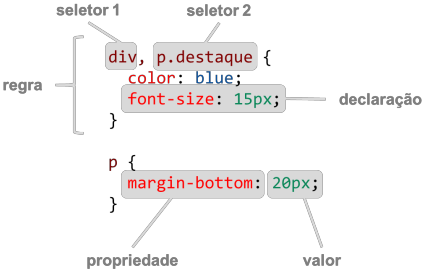


- [3.2.1 Seletores CSS](https://www.youtube.com/watch?v=AUG6ml3v8Yk)


- Seletores de elementos
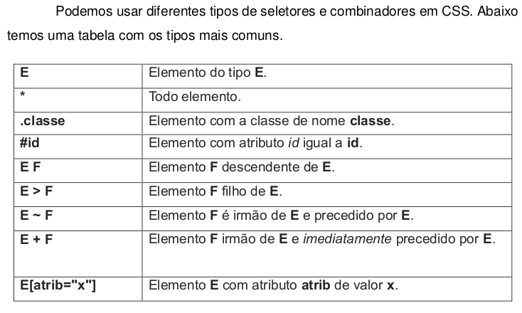

- Seletor de elemento
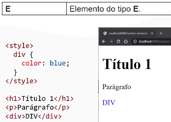

- Seletor de todos elementos
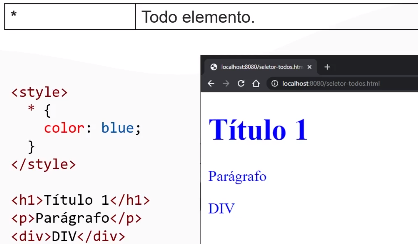

- Seletor por classe
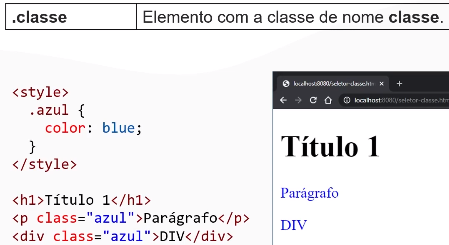

- Elemento com atributo id igual a id.
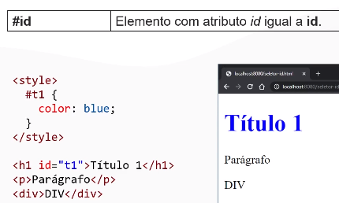


- Combinador Descendente e filho
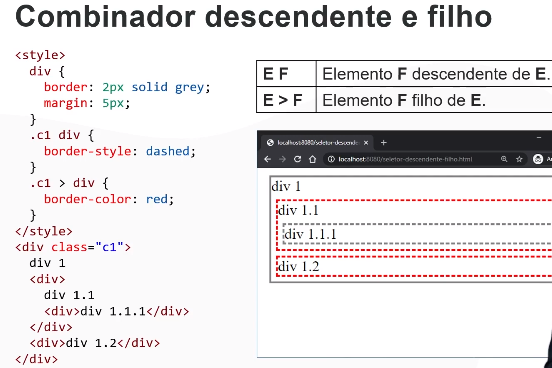

    - Elemento F descendente de E.
    - Elemento F filho de E.


    - .c1 div 
        - divs descendentes de c1
    - .c1 > div
        - divs filhos diretos da classe c1


- Combinador + e ~
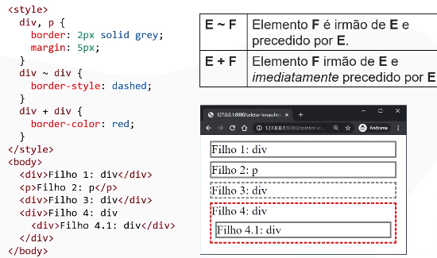

    - Elemento F é irmão de E e precedido por E.
    - Elemento F irmão de E e imediatamente precedido por E.


- Elemento E com atributo atrib de valor x.


### Pseudoclasses 

- Pseudoclasses
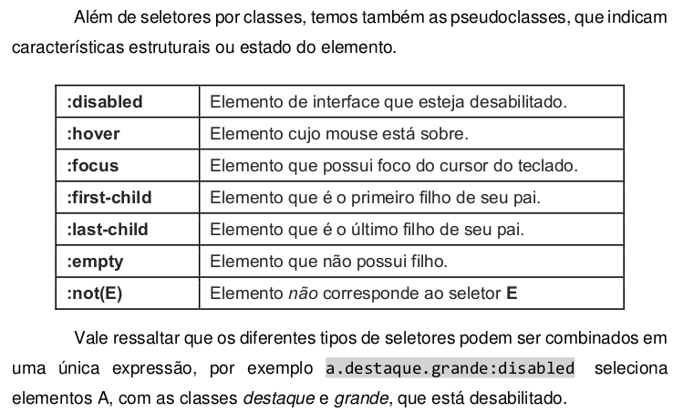

- Seletores compostos
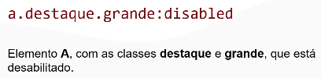

- Seletores complexos
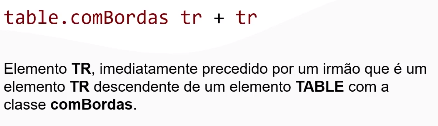

- Especifidade de seletores
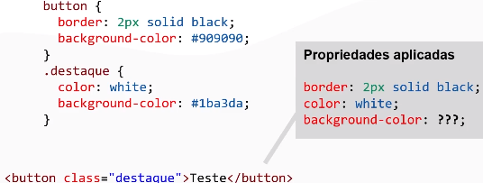

- Especifidade de seletores
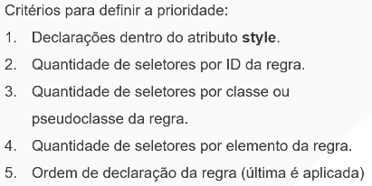

- [FEN 3.2.2 Usar seletores para estilizar uma lista](https://www.youtube.com/watch?v=nXnoATgeniA)

```css
Estilizar as listas no HTML dado, que possuem a classe `listaBonita`,
de acordo com os requisitos abaixo, mas sem mexer no HTML. Note que as regras
CSS não podem afetar listas que não possuem a classe `listaBonita`.

[ ] Os itens da lista não devem ter bullets (`list-style: none`).
li filho direto de ul.listaBonita
ul.listaBonita > li {
  list-style: none;
  }

[ ] A cor da fonte deve ser `#353535` (`color`).
ul.listaBonita {
  color: #353535;
}

[ ] Devem haver bordas de 2px em volta da lista e entre cada item (`border`, `border-width`, `border-style`, `border-color`). A cor padrão da borda é `#a0a0a0`.
ul.listaBonita > li {
  list-style: none;
  border-width: 2px;
  border-color: #a0a0a0;
}


[ ] O espaçamento entre as bordas e o conteúdo do item deve ser 4px na vertical e 8px na horizontal (`padding: 4px 8px`).
ul.listaBonita > li {
  padding: 4px 8px;
}

[ ] As bordas em volta da lista devem ter cantos arredondados com raio de 3px (`border-radius`, `border-top-left-radius`, `border-top-right-radius`, etc.).
Arredondando top primeiro
ul.listaBonita > li:first-child {
  border-top-style: solid;
  border-top-left-radius: 3px;
  border-top-right-radius: 3px;
}
Arredondamento bottom último 
ul.listaBonita > li:last-child {
  border-bottom-left-radius: 3px;
  border-bottom-right-radius: 3px;
  border-bottom-style: solid;
}

[ ] Itens com a classe `selecionado` devem ter cor de fundo `#bfdbff` (`background-color`) e bordas azuis de cor `#2e79db`. A borda em todos os lados de um item selecionado deve ser azul.
ul.listaBonita > li.selecionado {
  background-color: #bfdbff;
  border-color: #2e79db;
  border-bottom-style: solid;
}

ul.listaBonita > li:not(.selecionado) + li {
  border-top-style: solid;
}

[ ] A cor de fundo dos itens não selecionados deve mudar para `#ebebeb` ao passar o mouse por cima do item (pseudoclasse `:hover`).
ul.listaBonita > li:hover {
  background-color: #ebebeb;
}

```

```html
<!DOCTYPE html>
<head>
  <link rel="stylesheet" href="lista.css" />
</head>

<body>
  <ul class="listaBonita">
    <li>Item 1</li>
    <li>Item 2</li>
    <li>Item 3</li>
  </ul>

  <ul class="listaBonita">
    <li class="selecionado">Item 1</li>
    <li class="selecionado">Item 2</li>
    <li>Item 3</li>
  </ul>

  <ul class="listaBonita">
    <li>Item 1</li>
    <li class="selecionado">Item 2</li>
    <li>Item 3</li>
    <li class="selecionado">Item 4</li>
  </ul>

  <ul class="listaBonita">
    <li>Item 1</li>
  </ul>

  <ul class="listaBonita"></ul>

  <ul>
    <li>Item 1</li>
    <li>Item 2</li>
    <li>Item 3</li>
  </ul>
</body>
```

```css
html {
  font-size: 18px;
  font-family: Arial;
}

ul.listaBonita > li {
  list-style: none;
  border-width: 2px;
  border-color: #a0a0a0;
  padding: 4px 8px;
  border-left-style: solid;
  border-right-style: solid;
}

ul.listaBonita {
  color: #353535;
}

ul.listaBonita > li:first-child {
  border-top-style: solid;
  border-top-left-radius: 3px;
  border-top-right-radius: 3px;
}

ul.listaBonita > li:last-child {
  border-bottom-left-radius: 3px;
  border-bottom-right-radius: 3px;
  border-bottom-style: solid;
}

ul.listaBonita > li:hover {
  background-color: #ebebeb;
}

ul.listaBonita > li.selecionado {
  background-color: #bfdbff;
  border-color: #2e79db;
  border-bottom-style: solid;
}

ul.listaBonita > li:not(.selecionado) + li {
  border-top-style: solid;
}
```


- [FEN 3.3   Dimensionamento e posicionamento de elementos correto - YouTube](https://www.youtube.com/watch?v=YT6gZuY7ZFY)


- [FEN 3.4   Posicionamento fora do normal flow - YouTube](https://www.youtube.com/watch?v=OJR2DULSbXs)


- [FEN 3.5 Flexbox layout - YouTube ](https://www.youtube.com/watch?v=sXpLceQ6nyI)


- [FEN 3.5.1   Imitar layout Stack Overflow - YouTube ](https://www.youtube.com/watch?v=qZmjSneDudk)


- [FEN 3.5.2   Imitar layout Stack Overflow parte 2 - YouTube ](https://www.youtube.com/watch?v=yq6lDwT8udo)


- [FEN 3.5.3   Imitar layout Stack Overflow parte 3 - YouTube](https://www.youtube.com/watch?v=YyQeFMRsAdU)


