# CSS  - Cascade Style Sheet - folha de estilo em cascata

## Utilizando CSS

- [FEN 3.1   Introdução a CSS e sintaxe básica](https://www.youtube.com/watch?v=7ZnsxW9p8dk)

- Referência ao arquivo pelo html
  
  ```html
  <head>
    <link rel="stylesheet" href="exemplo-1.css" />
  </head>  
  ```

- Entre tags ```<style> no próprio HTML```
  
  ```html
    - <style>
    div {
        color: blue;
    }
  </style>
  ```

- Semântica
  

- [3.2.1 Seletores CSS](https://www.youtube.com/watch?v=AUG6ml3v8Yk)

- Seletores de elementos
  

- Seletor de elemento
  

- Seletor de todos elementos
  

- Seletor por classe
  

- Elemento com atributo id igual a id.
  

- Combinador Descendente e filho
  
  
  - Elemento F descendente de E.
  
  - Elemento F filho de E.
    
    - .c1 div 
      - divs descendentes de c1
    - .c1 > div
      - divs filhos diretos da classe c1

- Combinador + e ~
  
  
  - Elemento F é irmão de E e precedido por E.
  - Elemento F irmão de E e imediatamente precedido por E.

- Elemento E com atributo atrib de valor x.

### Pseudoclasses

Pseudo-classes are keywords that specify a special state of an element in CSS. They are used to style elements based on their attributes, content, or interaction. 

- Pseudoclasses
  

- Seletores compostos
  

- Seletores complexos
  

- Especifidade de seletores
  

- Especifidade de seletores
  

- [FEN 3.2.2 Usar seletores para estilizar uma lista](https://www.youtube.com/watch?v=nXnoATgeniA)

```css
Estilizar as listas no HTML dado, que possuem a classe `listaBonita`,
de acordo com os requisitos abaixo, mas sem mexer no HTML. Note que as regras
CSS não podem afetar listas que não possuem a classe `listaBonita`.

[ ] Os itens da lista não devem ter bullets (`list-style: none`).
li filho direto de ul.listaBonita
ul.listaBonita > li {
  list-style: none;
  }

[ ] A cor da fonte deve ser `#353535` (`color`).
ul.listaBonita {
  color: #353535;
}

[ ] Devem haver bordas de 2px em volta da lista e entre cada item (`border`, `border-width`, `border-style`, `border-color`). A cor padrão da borda é `#a0a0a0`.
ul.listaBonita > li {
  list-style: none;
  border-width: 2px;
  border-color: #a0a0a0;
}


[ ] O espaçamento entre as bordas e o conteúdo do item deve ser 4px na vertical e 8px na horizontal (`padding: 4px 8px`).
ul.listaBonita > li {
  padding: 4px 8px;
}

[ ] As bordas em volta da lista devem ter cantos arredondados com raio de 3px (`border-radius`, `border-top-left-radius`, `border-top-right-radius`, etc.).
Arredondando top primeiro
ul.listaBonita > li:first-child {
  border-top-style: solid;
  border-top-left-radius: 3px;
  border-top-right-radius: 3px;
}
Arredondamento bottom último 
ul.listaBonita > li:last-child {
  border-bottom-left-radius: 3px;
  border-bottom-right-radius: 3px;
  border-bottom-style: solid;
}

[ ] Itens com a classe `selecionado` devem ter cor de fundo `#bfdbff` (`background-color`) e bordas azuis de cor `#2e79db`. A borda em todos os lados de um item selecionado deve ser azul.
ul.listaBonita > li.selecionado {
  background-color: #bfdbff;
  border-color: #2e79db;
  border-bottom-style: solid;
}

ul.listaBonita > li:not(.selecionado) + li {
  border-top-style: solid;
}

[ ] A cor de fundo dos itens não selecionados deve mudar para `#ebebeb` ao passar o mouse por cima do item (pseudoclasse `:hover`).
ul.listaBonita > li:hover {
  background-color: #ebebeb;
}
```

```html
<!DOCTYPE html>
<head>
  <link rel="stylesheet" href="lista.css" />
</head>

<body>
  <ul class="listaBonita">
    <li>Item 1</li>
    <li>Item 2</li>
    <li>Item 3</li>
  </ul>

  <ul class="listaBonita">
    <li class="selecionado">Item 1</li>
    <li class="selecionado">Item 2</li>
    <li>Item 3</li>
  </ul>

  <ul class="listaBonita">
    <li>Item 1</li>
    <li class="selecionado">Item 2</li>
    <li>Item 3</li>
    <li class="selecionado">Item 4</li>
  </ul>

  <ul class="listaBonita">
    <li>Item 1</li>
  </ul>

  <ul class="listaBonita"></ul>

  <ul>
    <li>Item 1</li>
    <li>Item 2</li>
    <li>Item 3</li>
  </ul>
</body>
```

```css
html {
  font-size: 18px;
  font-family: Arial;
}

ul.listaBonita > li {
  list-style: none;
  border-width: 2px;
  border-color: #a0a0a0;
  padding: 4px 8px;
  border-left-style: solid;
  border-right-style: solid;
}

ul.listaBonita {
  color: #353535;
}

ul.listaBonita > li:first-child {
  border-top-style: solid;
  border-top-left-radius: 3px;
  border-top-right-radius: 3px;
}

ul.listaBonita > li:last-child {
  border-bottom-left-radius: 3px;
  border-bottom-right-radius: 3px;
  border-bottom-style: solid;
}

ul.listaBonita > li:hover {
  background-color: #ebebeb;
}

ul.listaBonita > li.selecionado {
  background-color: #bfdbff;
  border-color: #2e79db;
  border-bottom-style: solid;
}

ul.listaBonita > li:not(.selecionado) + li {
  border-top-style: solid;
}
```

- [FEN 3.3   Dimensionamento e posicionamento de elementos correto - YouTube](https://www.youtube.com/watch?v=YT6gZuY7ZFY)

Nesta aula 

Estudar dimensionamento de lementos:

- box model

- Unidades de medidas mais utilizadas

Entender como os elementos são posicionados na página

- Normal flow

- text-align

- Baseline e vertical-align

## Box model

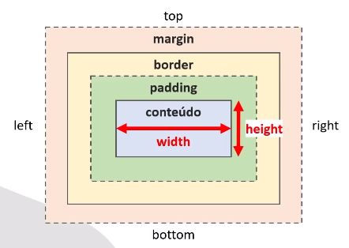

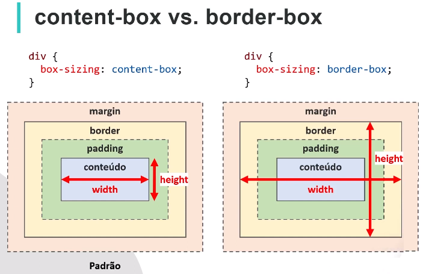

## Unidades de medida

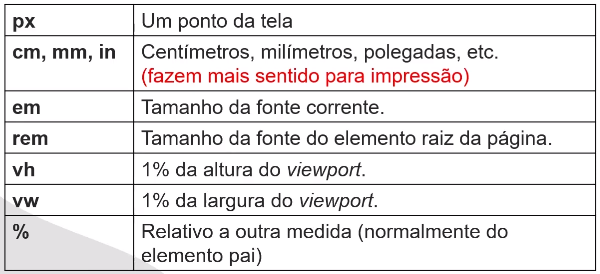

## Overflow

O comportamento quando um conteúdo não cabe dentro de um elemento é determinado pela propriedade overflow, que pode ter os valores:

- visible (padrão): conteúdo pode ser renderizado fora do box.

- hidden: conteúdo é cortado.

- scroll: exibe scroll bar sempre.

- auto: exibe scroll bar, se precisar.

Posicionamento de boxes

- Se não especificado, segue o normal flow (flow layout)

- Dois tipos de boxes 
  
  - block box
  
  - inline box

Posicionamento padrão dos elementos (normal flow)

Padrão, os elementos são dispostos na página em linha (ao lado do
anterior), 

### Block box

- Exibido em uma nova linha

- Largura 100% da largura disponível em seu container

- Exemplos:  h1, div e p são block boxes, 

### Inline box

- Exibidos na mesma linha (Pode haver quebra se não houver espaço)

- widht e height não se aplicam

- margin, padding e border verticais se comportam diferente (não empurram os boxes vizinhos)

- span, a, img, em, strong

Margens verticais não se somam. (margin colapse)

Se os dois elementos tiverem margin = 8 a distância entre eles será 8 e não a soma 8+8.

### Propriedade text-align

Somente elementos in-line, não funciona para block boxes

- cujos valores podem ser: **left, right, center, justify**

### Propriedade vertical-align

- Controla o alinhamento vertical de inline boxes, ou células de tabelas

- Valores comuns: baseline, middle, top, bottom

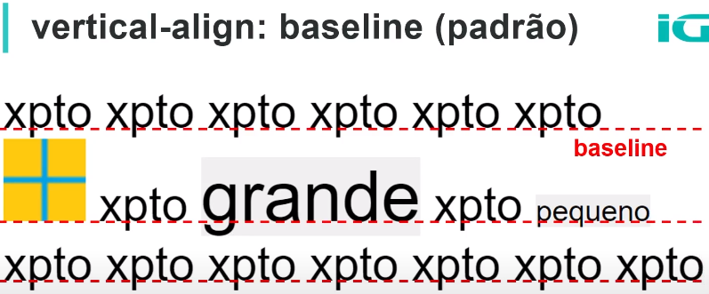

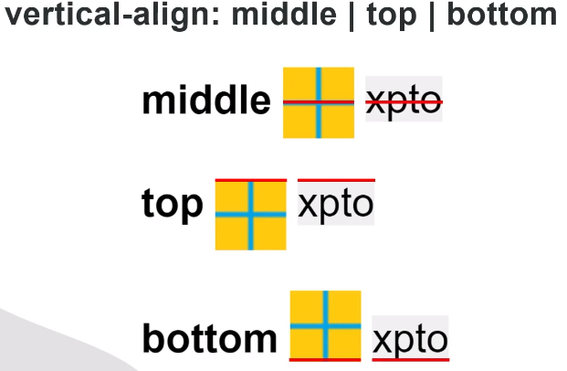

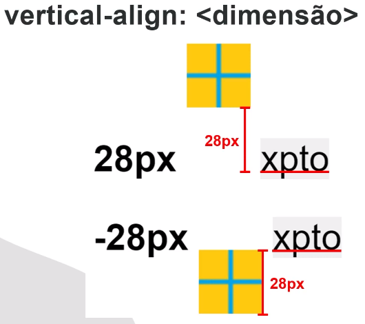

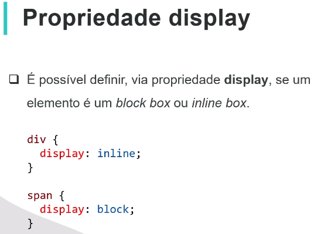

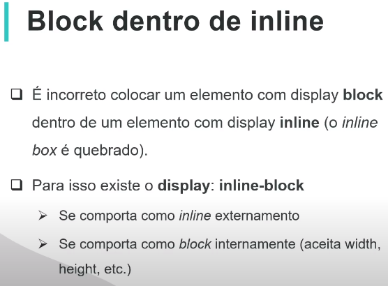

[FEN 3.4   Posicionamento fora do normal flow - YouTube](https://www.youtube.com/watch?v=OJR2DULSbXs)


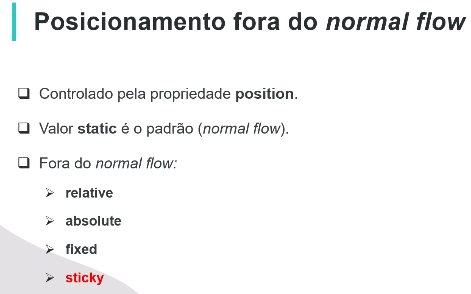

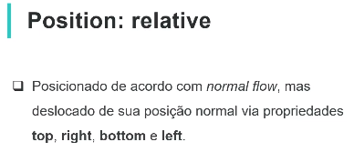

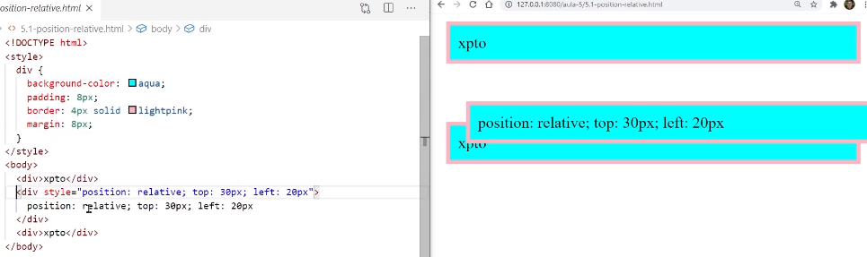


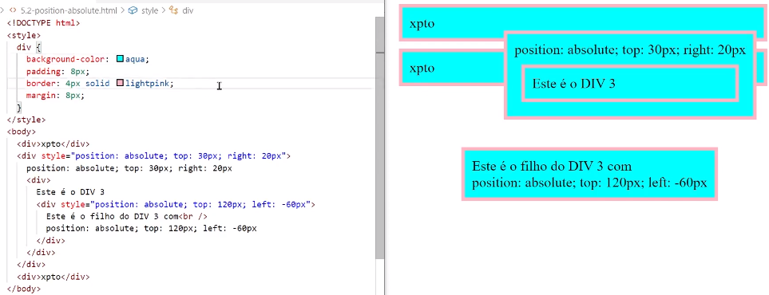


Fixed não sofre scroll


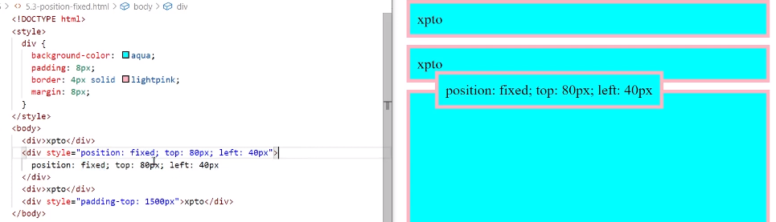


[FEN 3.5 Flexbox layout - YouTube](https://www.youtube.com/watch?v=sXpLceQ6nyI)

## Flex box Layout

display: flex 

    Comportamento block box externamente, e flexbox layout internamente;

inline-flex

    Comportamento inline box externamente, e flexbox layout internamente

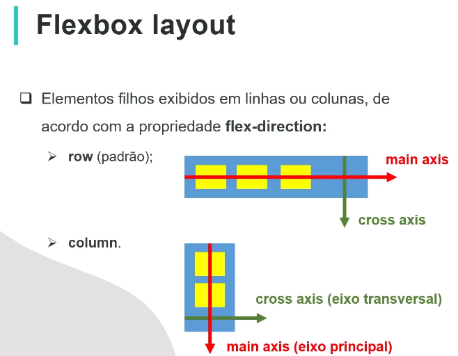

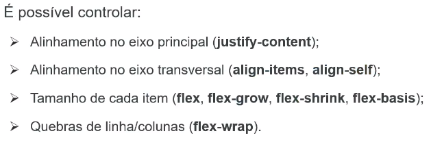

Exemplos:

flexbox.css

```css
html {
  font-family: Arial;
}
.fb {
  background-color: rgb(0, 174, 255);
  display: flex;
  width: 300px;
  height: 120px;
}
.fb > div {
  background-color: yellow;
  border: 2px solid red;
  margin: 6px;
  padding: 0 6px;
  text-align: center;
}
```

### Justify content

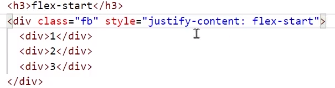

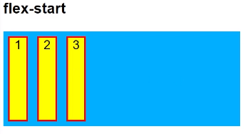

___

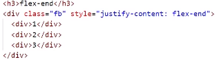

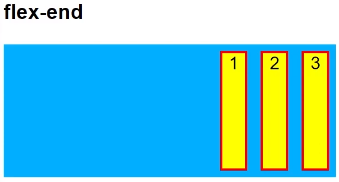

____

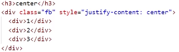

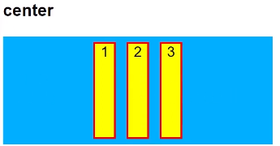

____

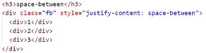

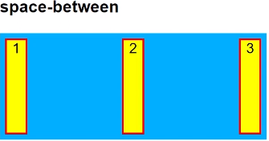

___

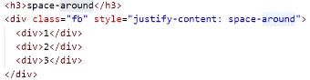

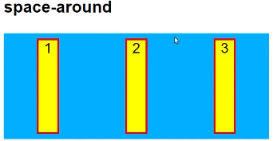

___

### align-itens

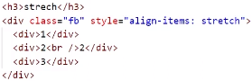

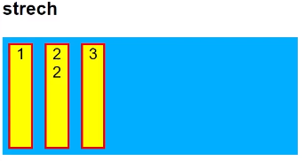

___

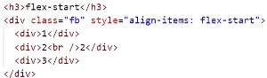

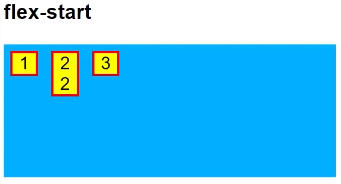

____

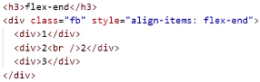


____

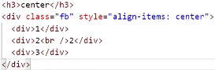

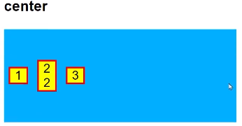

____

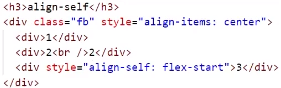

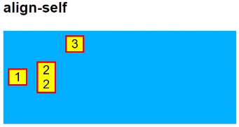

____

### flex property

flex: 0 1 auto é o padrão, caso nada seja digitado

flex: grow, shrink e basis

Definido no crescimento ou diminuição


- flex-grow: 
  
  - specifies how much a flex item will grow relative to the rest of the flex items in the container when there is extra space available. The default value is 0, meaning the item will not grow beyond its original size1. If you set flex-grow to 1, the element can grow to use up any extra space2.

- flex-shrink: 
  
  - how much a flex item will shrink relative to the rest of the flex items in the container when there isn’t enough space available13. The default value is 1, meaning all items will shrink equally when there is not enough space3. If you set flex-shrink to 0, the element will not shrink below its original size2.

- flex-basis, which defines the initial main size of a flex item.

---


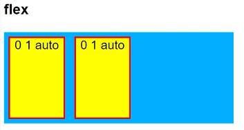

---

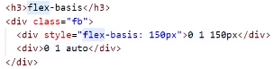

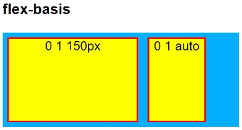

____

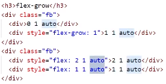

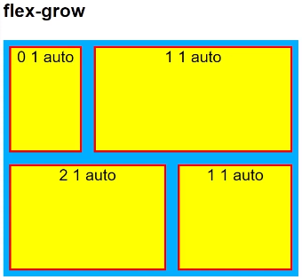

---

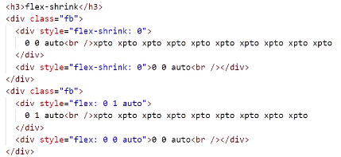

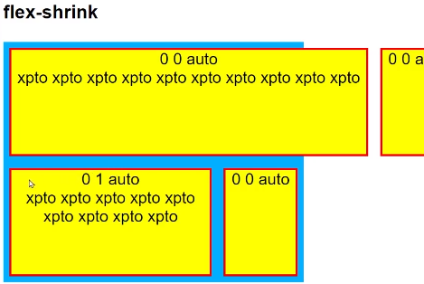

---

### flex-wrap

Padrão nowrap

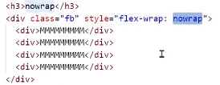

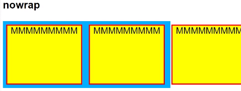

---

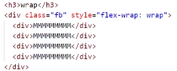

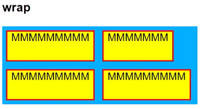

---

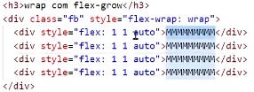

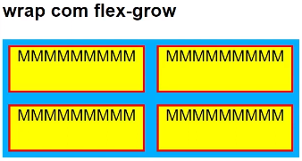

---


[FEN 3.5.1   Imitar layout Stack Overflow - YouTube ](https://www.youtube.com/watch?v=qZmjSneDudk)

[FEN 3.5.2   Imitar layout Stack Overflow parte 2 - YouTube ](https://www.youtube.com/watch?v=yq6lDwT8udo)

[FEN 3.5.3   Imitar layout Stack Overflow parte 3 - YouTube](https://www.youtube.com/watch?v=YyQeFMRsAdU)


