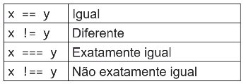

# Javascript - ECMAScript

- [FEN 4.1   Introdução a JavaScript - YouTube ](https://www.youtube.com/watch?v=Epyg4LLuyX8)
- JavaScript é uma linguagem dinâmica e interpretada 
  - Dinâmica pode modificar o tipo da variável com outra atribuição
  - Executada no navegador

### Adicionando script na página

- Arquivo
  
  ```html
  <script src="./js/meu-script-externo.js"></script>
  ```

- Página - inline
  
  ```html
  <script>
    console.log('Este é um script inline');
  </script>
  ```

```html
var mensagem = 'Olá';
mensagem = 'Olá Robinson';
alert(mensagem); // comentário
// comentário de uma linha
/*
comentário de várias linhas
*/
```

- [FEN 4.2   Tipos e valores em JavaScript](https://www.youtube.com/watch?v=eSDLpppU1bs)

- JavaScript possui os tipos primitivos number (número inteiro ou fracionário),
  string (sequência de caracteres) e boolean (verdadeiro ou falso). Valores primitivos
  são declarados como no código a seguir.

- Tipos de variáveis
  
  ```javascript
  var vNumber = 5.78;
  var vString = 'abacaxi';
  var vBoolean = true; 
  typeof vBoolean // retorna o tipo do objeto
  ```

- Objetos Javascript
  
  ```javascript
  var aluno1 = {
  matricula: 7627364,
  nome: 'Robinson',
  curso: 'Bootcamp Front End',
  ativo: true
  };
  ```
  
    aluno1.matricula 7627364
    aluno1.nome  Robinson
    aluno1.curso Bootcamp Front End
    aluno1.ativo true
    // Deletando um campo de um objeto criado
    delete aluno1.ativo;
    Se acessarmos uma variável de um objeto deletado ou que não existe o retorno é  undefined 

- Arrays
  
  ```javascript
  var alunos = []
  alunos.push("Robinson") 
  var frutas = ["maçã","banana","pera"]
  ```

frutas[0]
// "maçã" 

frutas[3] 
//undefined 

- Tipos primitivos
  
  - Cópia é por valor

- Cópia de objetos - por referência ou endereço de memória
  
  - copia o endereço do objeto e não o objeto em si

- [FEN 4.3   Operadores e expressões](https://www.youtube.com/watch?v=3SeeKvBHWvU)

- Operadores
  
  - Lógicos
    
    - !  // Negação
      
      - !true = false
      - !false = true
    
    - &&    // E lógico 
      
      - true && false = false 
      - false && false = false
    
    - ||    // Ou lógico
  
  - Aritméticos

            

        - Operadores aritméticos de atribuição

            

        - Operadores de incremento / decremento

            

        - Comparação

                        

        - Igualdade

            

            === comparação estrita, somente tipos iguais

            == compara mesmo tipos diferentes

           - Precedência de operadores

                

[FEN 4.4   Funções e escopo](https://www.youtube.com/watch?v=i10fbmje57w)


Variável global

Disponível em todo código, inclusive em outros arquivos de script carregados.


[FEN 4.5   Comandos de decisão](https://www.youtube.com/watch?v=_OLrl5nraIo)

### Comandos de decisão


&&


Ternário


switch


[FEN 4.6 Comandos de repetição](https://www.youtube.com/watch?v=eAUyHzzo0YI)

### Comandos de repetição


while


do while


for


Possível utilizar o break e continue, para parar e pular uma repetição respectivamente


[FEN 4.6.1 Desafio guiado Palíndromo](https://www.youtube.com/watch?v=yOZew8rFkmY)


### Interação com o DOM


[FEN 5.1   Interação básica com o DOM - YouTube](https://www.youtube.com/watch?v=qsuTjigeJ9I) 

Por meio de JavaScript é possível interagir com os elementos da página,
utilizado a API conhecida como DOM (Document Object Model). O DOM nada mais é
do que uma estrutura de dados que representa todos os elementos da página como
objetos que podem ser acessados e modificados via JavaScript. Entre outras tarefas,
podemos modificar o conteúdo da página e reagir a eventos.

```javascript
// obtém o elemento pelo id
var el1 = document.getElementById("idElemento");
// obtém o primeiro elemento capturado pelo seletor
var el2 = document.querySelector("div.destaque");
// obtém lista de todos os elementos capturados pelo seletor
var elList = document.querySelectorAll("li.selecionado");
```

Adicionalmente, podemos navegar nos elementos e seus filhos a partir da raiz. Por
exemplo, document.body.children[0] obtém o primeiro filho do elemento body.

```javascript
var el1 = document.getElementById("idElemento");
el1.textContent = "novo texto"; // muda o conteúdo de el1
```

```javascript
<button onclick="soma()">Calcular</button>
```

[FEN 5.2   Eventos - YouTube](https://www.youtube.com/watch?v=QboE5JIVdPk) 

Além de reagir a eventos por meio do atributo onclick e outros, podemos
registrar listeners de eventos via JavaScript.

```javascript
var el = document.getElementById("mybtn");
// registra listener do evento click
el.addEventListener("click", myHandler);
// se precisar, remove o listener
el.removeEventoListener("click", myHandler)
```

```javascript
// registra na fase de capturing
el.addEventListener("click", myHandler, true);
// registra na fase de bubbling
el.addEventListener("click", myHandler, false);
```

```javascript
function myHandler(event) {
console.log("clicou na posição " + event.pageX + ", " + event.pageY);
}
```

O objeto evento também nos permite chamar as funções 
- **stopPropagation** interrompe a propagação do evento,

- **preventDefault** impede o tratamento padrão do navegador (por exemplo, seguir um link ao
clicar no mesmo).

### Tipos de eventos usados frequentemente
| Evento | Disparo |
|-|-|
| focus | Elemento recebe foco. |
| blur | Elemento perde foco. |
| input | Valor de um elemento muda (input, select, textarea). |
| submit | Formulário submetido. |
| keydown | Tecla do teclado pressionada. |
| keyup | Tecla do teclado liberada. |
| click | Botão do mouse pressionado e liberado. |
| mousemove | Mouse movimentado sobre o elemento. |


[FEN 5.3   Criando elementos dinamicamente - YouTube](https://www.youtube.com/watch?v=m6q2IVMb0gg) 

Podemos utilizar as funções document.createElement e elemento.appendChild para criar elementos dinamicamente e inseri-los no DOM.
Também podemos inserir elementos antes de outro elemento informado usando elemento.insertBefore. Por fim, podemos remover elementos do DOM com a função elemento.remove.

```javascript
// Cria um elemento
var myDiv = document.createElement("div");
// Insere o elemento na página, no final do body
document.body.appendChild(myDiv);
// Cria outro elemento
var myH2 = document.createElement("h2");
myH2.textContent = "Dynamic H2";
// Insere ele antes do div
document.body.insertBefore(myH2, myDiv);
// Remove da página
myDiv.remove();
```
Uma outra maneira de criar elementos dinamicamente é por meio da
propriedade innerHTML


[FEN 5.4   Alterando estilos de elementos - YouTube](https://www.youtube.com/watch?v=yo05S4LDnf4) 

Podemos alterar os estilos de um elemento via propriedade style

```javascript
// Define style como string
el.style = "color: red; margin: 4px";
// Define propriedade individuais do style
el.style.color = "red";
```

```javascript
// Define className (que corresponde ao atributo class)
el.className = "classe1 classe2";
// Adiciona ou remove classes individualmente
el.classList.add("classe1");
el.classList.remove("classe1");
```

### Orientação a objetos em JavaScript

[FEN 6.1 Instanciando objetos - YouTube](https://www.youtube.com/watch?v=2eOTY8vCVH4) 

```javascript
function Retangulo(altura, largura) {
this.altura = altura;
this.largura = largura;
this.area = function () {
return this.altura * this.largura;
};
}
var r1 = new Retangulo(3, 4);
```

```javascript
function RetanguloV2(altura, largura) {
this.altura = altura;
this.largura = largura;
}
RetanguloV2.prototype.area = function () {
return this.altura * this.largura;
};
```

Classes e herança

```javascript
class Retangulo {
constructor(altura, largura) {
this.altura = altura;
this.largura = largura;
}
area() {
return this.altura * this.largura;
}
}
```

```javascript
class Quadrado extends Retangulo {
constructor(dimensao) {
super(dimensao, dimensao);
}
}
```

[FEN 6.2 Prototype chain - YouTube](https://www.youtube.com/watch?v=dfS0D3P-m5g)


[FEN 6.3 Classes e herança - YouTube](https://www.youtube.com/watch?v=Y5f-P6KokdY) 

### JavaScript moderno

[FEN 7.1 Let, const, desestruturação, spread e template strings - YouTube](https://www.youtube.com/watch?v=sYvstzx7fCA)

[FEN 7.2 Arrow functions - YouTube](https://www.youtube.com/watch?v=TuQlhJywj-Y)


[FEN 7.3 Manipulação de arrays - YouTube](https://www.youtube.com/watch?v=3KfGPr1WGgg)


[FEN 7.4 Módulos - YouTube](https://www.youtube.com/watch?v=TLYfeciIiWg) 
### Requisições HTTP em JavaScript - Parte I


[FEN 8.1 A API fetch - YouTube](https://www.youtube.com/watch?v=F2hhQfMBuQc)


[FEN 8.2  Dominando promises carregamento sequencial e paralelo - YouTube](https://www.youtube.com/watch?v=QzVPmWWAltg)


[FEN 8.3 Async await - YouTube](https://www.youtube.com/watch?v=SU6i_QVFNLE) 


[FEN 8.4   Tratamento de erros - YouTube](https://www.youtube.com/watch?v=5Um7eN7Y434) 


### Requisições HTTP em JavaScript - Parte II


[FEN 8.4.1   Desafio guiado CRUD completo - YouTube](https://www.youtube.com/watch?v=DnCRizbW51U)


[FEN 8.4.2   Desafio guiado CRUD completo parte 2 - YouTube](https://www.youtube.com/watch?v=fzFJ3KYRFpI)


[FEN 8.4.3   Desafio guiado CRUD completo parte 3 - YouTube](https://www.youtube.com/watch?v=j1FNmGzjvdU)


[FEN 8.4.4   Desafio guiado CRUD completo parte 4 - YouTube](https://www.youtube.com/watch?v=RQm2NQgh70E)


### Tarefas temporizadas ou periódicas em JavaScript


[FEN 9 1   setTimeout - YouTube](https://www.youtube.com/watch?v=ShxdFG9-tbs)

[FEN 9.2   setInterval - YouTube](https://www.youtube.com/watch?v=Yj-aVw8ZajA)

[FEN 9.3   requestAnimationFrame - YouTube](https://www.youtube.com/watch?v=JbRHGtaVs1I)
